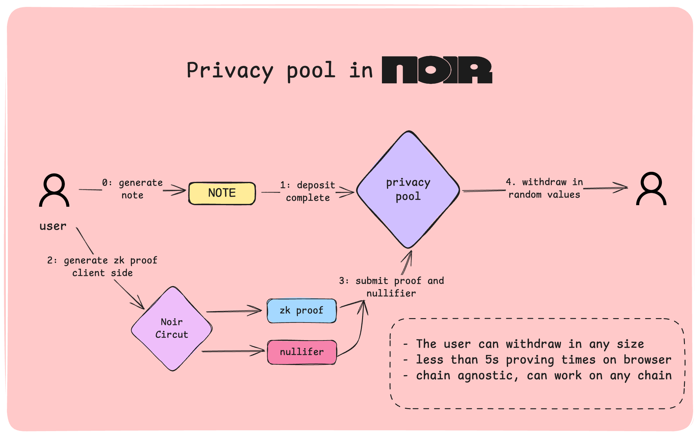

# Privacy Pool

A privacy-preserving mixing pool implementation with both Noir and ZisK zkVM versions. This project demonstrates UTXO-based transaction privacy through cryptographic commitments and Merkle tree proofs.



## Implementation Overview

This repository contains two implementations:

1. **Original Noir Version** (`src/main.nr`, `web-app/`, `scripts/`): Single-user privacy pool using Noir circuits
2. **ZisK zkVM Version** (`privacy-pool-zkvm/`): Multi-user UTXO-based privacy pool running in ZisK zkVM

## How It Works

The privacy pool uses **commitment schemes** and **zero-knowledge proofs** to break the link between deposits and withdrawals:

1. **Deposit**: Users deposit funds by creating UTXOs with secret commitments
2. **Merkle Tree**: All UTXO commitments are stored in a Merkle tree for efficient membership proofs
3. **Withdrawal**: Users generate zero-knowledge proofs demonstrating:
   - Knowledge of a valid UTXO commitment
   - No double-spending (nullifier mechanism)
   - Valid withdrawal amount
4. **Privacy**: Withdrawals are unlinkable to deposits through ZK proofs

## Getting Started

### ZisK zkVM Version (Recommended)

The ZisK implementation provides multi-user support and UTXO-based transactions:

1. **Prerequisites:**
   - [Rust](https://rustup.rs/) (latest stable)
   - [ZisK](https://0xpolygonhermez.github.io/zisk/) installed

2. **Build and test:**
   ```bash
   cd privacy-pool-zkvm
   cargo-zisk build
   cargo run --bin simple_test
   ./run_test.sh
   ```

3. **Generate ZK proof:**
   ```bash
   cargo-zisk prove -e target/riscv64ima-zisk-zkvm-elf/release/privacy-pool-zkvm -i build/input.bin -o proof -a -y
   ```

### Original Noir Version

1. **Prerequisites:**
   - [Bun](https://bun.sh) (latest version)
   - [Node.js](https://nodejs.org) (v18 or higher)

2. **Run web application:**
   ```bash
   # Install dependencies
   bun install
   cd web-app && bun install
   
   # Start development server
   bun run dev
   ```

3. **CLI scripts:**
   ```bash
   bun run init      # Initialize system
   bun run deposit   # Make deposit
   bun run withdraw  # Make withdrawal
   bun run gen-proof # Generate proof
   ```

## Project Components

### ZisK zkVM Implementation (`privacy-pool-zkvm/`)

**Core Components:**
- **`src/main.rs`**: ZisK entry point for transaction processing
- **`src/privacy_pool.rs`**: Multi-user privacy pool logic with UTXO management
- **`src/utxo.rs`**: UTXO data structures and transaction types
- **`src/merkle_tree.rs`**: Merkle tree implementation for commitment storage
- **`src/zk_proofs.rs`**: Zero-knowledge proof generation and verification

**Test Components:**
- **`src/simple_test.rs`**: Basic deposit transaction test
- **`src/create_multi_user_test.rs`**: Multi-user scenario test
- **`run_test.sh`**: Automated build and test script

**Generated Files:**
- **`build/input.bin`**: Serialized transaction data for ZisK
- **`proof/`**: Generated ZK proofs and verification results

### Original Noir Implementation

**Core Circuit (`src/main.nr`):**
- Single-user privacy pool using Noir circuits
- SHA-256 compression for commitments
- Merkle proof verification
- Nullifier system for double-spend prevention

**CLI Scripts (`scripts/`):**
- `init.ts`, `deposit.ts`, `withdraw.ts`: Core transaction operations
- `gen_proof.ts`, `get_latest_note.ts`: Proof generation and retrieval
- `lib/`: Storage management and utility functions

**Web Application (`web-app/`):**
- React-based UI for transaction management
- `BankingInterface.tsx`: Main transaction interface
- `ui/`: Reusable UI components

## Architecture

```
┌─────────────────┐    ┌─────────────────┐    ┌─────────────────┐
│   Web App UI    │    │   CLI Scripts   │    │  Noir Circuit   │
│                 │    │                 │    │                 │
│ • Deposits      │    │ • init.ts       │    │ • Commitment    │
│ • Withdrawals   │    │ • deposit.ts    │    │ • Merkle Proof  │
│ • Balance       │    │ • withdraw.ts   │    │ • Nullifiers    │
│ • History       │    │ • gen_proof.ts  │    │ • ZK Proofs     │
└─────────────────┘    └─────────────────┘    └─────────────────┘
         │                       │                       │
         └───────────────────────┼───────────────────────┘
                                 │
                    ┌─────────────────┐
                    │  Local Storage  │
                    │                 │
                    │ • Notes         │
                    │ • Tree State    │
                    │ • Balances      │
                    │ • Commitments   │
                    └─────────────────┘
```

## Key Features

**ZisK zkVM Version:**
- **Multi-user Support**: Multiple users can interact with the same pool
- **UTXO Model**: Bitcoin-style transaction model with unspent outputs
- **Merkle Tree State**: Shared state tree for all UTXO commitments
- **ZK Proof Generation**: Generates and verifies zero-knowledge proofs
- **Test Suite**: Automated testing with multiple transaction scenarios

**Original Noir Version:**
- **Single-user Privacy**: Basic privacy pool functionality
- **Web Interface**: React-based user interface
- **CLI Tools**: Command-line scripts for transactions
- **Commitment Scheme**: Cryptographic commitments for deposits

## Technology Stack

**ZisK Implementation:**
- **Rust**: System programming language
- **ZisK**: Zero-knowledge virtual machine
- **SHA-256**: Cryptographic hash function
- **Merkle Trees**: Efficient commitment storage

**Original Implementation:**
- **Noir**: Zero-knowledge proof system
- **TypeScript/React**: Frontend development
- **Bun**: JavaScript runtime
- **Poseidon**: ZK-optimized hash function

## Security Considerations

- **Commitment Uniqueness**: Each deposit generates a unique commitment
- **Nullifier Protection**: Prevents double-spending through nullifier tracking
- **Merkle Tree Integrity**: Ensures only valid commitments can be withdrawn
- **Zero-Knowledge**: Proofs reveal no information about the prover's identity
- **Storage Validation**: Automatic validation of stored data consistency

## Development Status

This project demonstrates privacy pool concepts with two implementations:
- **ZisK Version**: Multi-user UTXO-based privacy pool with working ZK proofs
- **Noir Version**: Single-user privacy pool with web interface

## ⚠️ Important Notice

**This code is experimental and unaudited. It is intended for educational and research purposes only. Do not use this code in production environments or with real funds.**

## Credits

This project builds upon the excellent work of several teams and projects:

- **[0xbow.io](https://0xbow.io)** - For inspiration on the random withdraw logic design
- **[Privacy Scaling Explorations (PSE)](https://github.com/privacy-scaling-explorations)** - For the invaluable ZK-Kit libraries:
  - [zk-kit.noir](https://github.com/privacy-scaling-explorations/zk-kit.noir) - Reusable Noir circuits including binary Merkle tree implementations
  - [zk-kit](https://github.com/privacy-scaling-explorations/zk-kit) - Comprehensive zero-knowledge libraries and utilities
- **[Noir Team](https://noir-lang.org/)** - For creating the amazing Noir language that makes zero-knowledge circuit development accessible and powerful

---

*Privacy Pool - Secure, Private, Decentralized*
